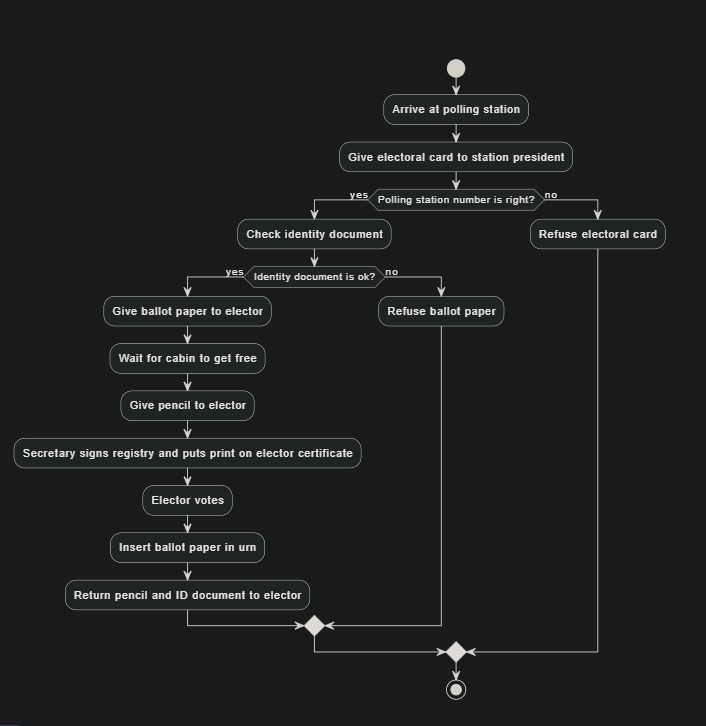

# 23738_ActivityDiagram

# SENG_415_Software-Modeling-and-Design

### Activity Diagram: Voting System

▰ Once arrived at the polling station, elector gives the own electoral
card to station president who checks if the polling station number is
right.

▰ Then he checks the identity document and if ok he gives the
ballot paper to the elector.

▰ Then the president waits for a cabin to get free and he gives the
pencil to the elector and a secretary who signs the registry and put a
print on the elector certificate. Once elector has voted, he/she inserts
the ballot paper in the urn, giving back the pencil and taking back the
own ID document.

